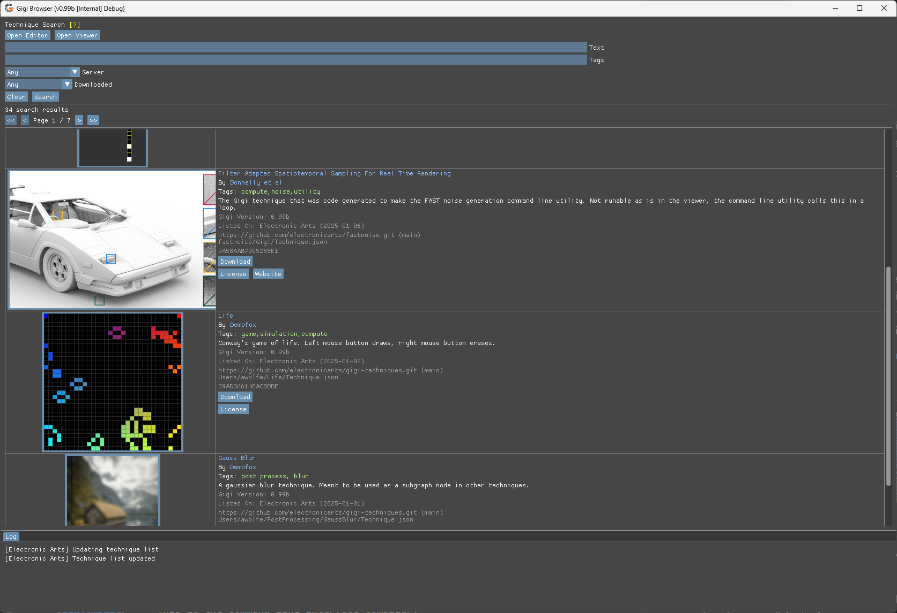

# Gigi

Gigi is software designed for rapid prototyping and development of real time rendering techniques. It is meant for use by professionals, researchers, students, and hobbyists.

Gigi allows you to work at the speed of thought in the Editor, then debug, profile and iterate in the Viewer, and finally use the Compiler to generate code for C++ DX12, WebGPU, or the Unreal Engine.

[See a Gallery of WebGPU Code Generated Gigi Techniques](https://electronicarts.github.io/gigi/)

[See what people say about using Gigi](readme/testimonials.md)

Gigi is made of four components:

1. Editor - Author a rendering technique
2. Viewer - Debug and profile the technique
3. Compiler - Generate code for the technique like a human would write
4. Browser - View a library of Gigi techniques, and submit your own

[Click here to read more about these components](readme/Overview.md)

Gigi Editor | Gigi Viewer
:-----:|:------:|
 | 

Gigi Compiler Generated Code (DX12) | Gigi Browser
:-----:|:------:|
 | 

Gigi is being actively used and developed, but is young software. You may hit bugs or missing features. Please report these so we can improve Gigi and push forward in the most useful directions. Pull requests are also appreciated! Please see the "Contributing" section below.

# Platform Support

Different platforms have different levels of feature support both due to platform limitations, as well as functionality needing to be implemented.  Please see this for details about what is supported on what platforms.

[Platform Support](readme/platformSupport.md)

# Building or Getting, and Running

Cloning this repo and then building gigi.sln is all that is needed to build Gigi.

To use prebuilt binaries, go to the releases tab https://github.com/electronicarts/gigi/releases/.  You can either download the .zip file, and extract that to the location of your choice, or you can download and run the installer exe.

There will be four executables in the root folder:

* **GigiEdit** - This is the editor.
* **GigiViewerDX12** - This is the viewer. 
* **GigiCompiler** - This is the command line interface compiler.
* **GigiBrowser** - This lets you browse, download, and open techniques from the technique library.

# Learning & Support

[Text and Video Tutorials](readme/tutorials/readme.md)

[Discord: Gigi Rapid Graphics Development](https://discord.gg/HPzqAw2H3k)

[Gigi Jam 2024 Lightning Talks (YouTube)](https://www.youtube.com/watch?v=m62ePwK33PM)

[Gigi Technical Overview (YouTube GPC 2024)](https://www.youtube.com/watch?v=MgCR-Kky628)

The browser lets you explore some examples to help get you started.  The **Techniques/UnitTests/** folder contains the unit tests, which aims to exercise every possible piece of functionality.

There are also documents in the **UserDocumentation** folder that explain the viewer python interface, Gigi shader tokens, and other things.

# Reporting Bugs & Making Feature Requests

For reporting bugs or making feature requests, create a new issue in this repo.

For bug reports, giving or linking to a zip file of a gigi technique and related files which reproduces the bug is helpful.  The more minimal the technique, the faster we can fix the problem.  Please also provide steps to see the problem, and how what happens differs from what you expect to happen.

For feature requests, the more information you give us about your need, the better we can come up with something to address the need.  We may not always give you what you want as you describe it, but we will aim to solve the spirit of what you are asking for, considering any other constraints that may be in play.

If you could also let us know the urgency of the bug or missing feature on your side, that will help us triage the work.  We can't promise to have an immediate resolution to your report, but we will do what we can, as soon as we can.

# Sharing Techniques In The Gigi Browser

See this document for more information: [Sharing Techniques In The Gigi Browser](readme/BrowserSharing.md)

# Contributors

Created by Alan Wolfe

**Contributors:**

Adam Badke

Alexey Gladkov

Andrew Steadman

Berk Emre Saribas

Chris Lewin

Christian Deiss

Gabriel Kannenberg

Ivar Jönsson

Jakub Marcowski

Jan Werbrouck

Martin Mittring

Mohit Sethi

Patrick Anderson

Richard Raquepo

Stephane Levesque

Tristan Calderbank

William Donnelly

Kyle Bostelmann

[Gigi would not be possible without several open sourced libraries](readme/OSS.md)

# Contributing

Before you can contribute, EA must have a Contributor License Agreement (CLA) on file that has been signed by each contributor.
You can sign here: http://bit.ly/electronic-arts-cla

Any contribution - large or small - is much appreciated and earns you a spot on the contributors list. Just add your name to the list (alpha sorted) as part of your pull request!

As far as coding standards, we need to write them up and automate them as much as we can, but for now, try to make your code look like other code.

With each pull request, besides testing any functionality you are touching, please also verify that both the viewer and dx12 unit tests are still passing, and consider adding unit tests if appropriate.

To run the viewer unit tests, from inside the viewer select File->Run Python Script and choose **Techniques/UnitTests/RunTests.py**.  It should report that it has zero errors.

To run the DX12 unit tests, first run the **MakeCode_UnitTests_DX12.bat** file to generate the code for the unit tests.  If this results in no diffs, you can consider it a success.  To actually run the generated tests, open and run **_GeneratedCode/UnitTests/DX12/UnitTests.sln**.  It should report that it has zero errors.

#

 
<b>Search for Extraordinary Experiences Division (SEED) - Electronic Arts   http://seed.ea.com</b> 
We are a cross-disciplinary team within EA Worldwide Studios. 
Our mission is to explore, build and help define the future of interactive entertainment.

